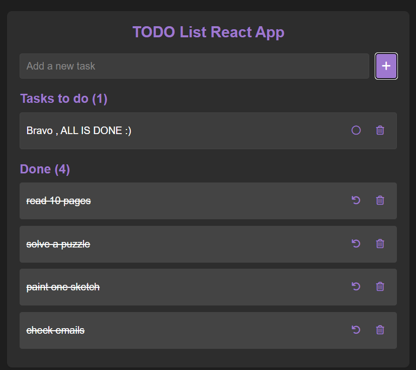

# Todo List App

A simple and intuitive Todo List application built with React. Manage your tasks efficiently with features like adding, editing, and deleting tasks.

<div align="center">
  
</div>


---

## Features

- **Add Tasks**: Easily add new tasks to your todo list.
- **Edit Tasks**: Update existing tasks with new details.
- **Delete Tasks**: Remove tasks you no longer need.
- **Mark as Complete**: Toggle tasks between completed and incomplete.
- **Responsive Design**: Works seamlessly on desktop and mobile devices.

---

## Technologies Used

- **React**: A JavaScript library for building user interfaces.
- **HTML/CSS**: For structuring and styling the application.
- **JavaScript**: For adding interactivity and functionality.
- **Git**: For version control and collaboration.

---

## Installation

Follow these steps to set up the project locally:

1. **Clone the Repository**:
   ```bash
   git clone https://github.com/nihalsabri/webDev.git
   cd webDev/todo_proj01
